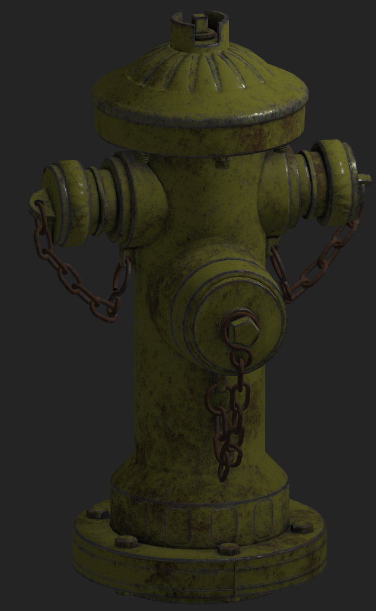

<!-- PROJECT LOGO -->
 

  

  <h3 align="center">Teapot Engine</h3>

  

    A minimal game engine implementation focused on beginner usability.
     
  

<!-- ABOUT THE PROJECT -->
## About Teapot

As I learned more about computer graphics and video games a like, I desire more and more to create my own game engine which would allow me to truly study the architecture and development of one. Every resource I found online lacked the friendliness torwards beginners to help spread the knowledge. Teapot is my attempt to remediate that, by designing a readibility-first engine; not focused on eeking out the best performance, or stunning graphics, but instead focused on documentation, readability, and usability.

(<a href="#top">back to top</a>)

### Built With

* [OpenGL](https://www.opengl.org//)
* [Dear Imgui](https://github.com/ocornut/imgui)
* [ASSIMP](https://www.assimp.org/)
* [C++](https://www.cplusplus.com/)
* [GLFW]

(<a href="#top">back to top</a>)

<!-- ROADMAP -->
## Roadmap

- [x] Initial engine refactor, focused on OOP-based design and best standards
- [x] GLFW Window Abstraction
- [ ] Renderer Abstraction
- [ ] Logging / Testing
- [ ] ImGui Revamp
- [x] Cameras
- [x] Geometry Importer
- [ ] Scenegraph
- [ ] Rendering API Abstraction
- [x] Lighting Update
  - [x] Materials
  - [x] Light Casters
  - [x] Lighting Maps (Diffuse, Specular, Bump/Normal)
  - [x] Shadows
  - [x] HDR
  - [x] Tonemapping
- [ ] Profiling
- [ ] Geometry Editing and Processing
- [ ] Advanced Lighting
  - [ ] GLTF Physically Based Rendering
    - [x] Materials
    - [x] Advanced Lighting Maps (Roughness, AO, Metallic, Mask, etc)
    - [ ] Image Based Lighting (Cubemaps)
  - [ ] Deffered Rendering
  - [ ] SSAO
  - [ ] Sceenspace Reflections
  - [ ] Optional Global Illumination (Voxel Cone Tracing)
- [ ] Physics
- [ ] Entity Component System
- [ ] Scene Saving / Loading
- [ ] Scene Editing (Picking)
- [ ] Skeletal Animation
  
### Maybe Maybe Not
- [ ] Particle System
- [ ] Game Scripting (LUA)
- [ ] Node System

## Examples

</img>
</img>
</img>

<!-- CONTACT -->
## Contact

Brennen Green - [@TheBrennenGreen](https://twitter.com/your_username) - brennengreen@outlook.com

(<a href="#top">back to top</a>)

